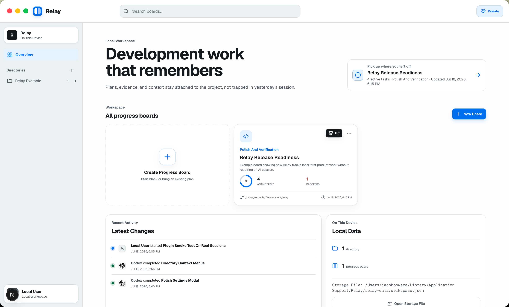
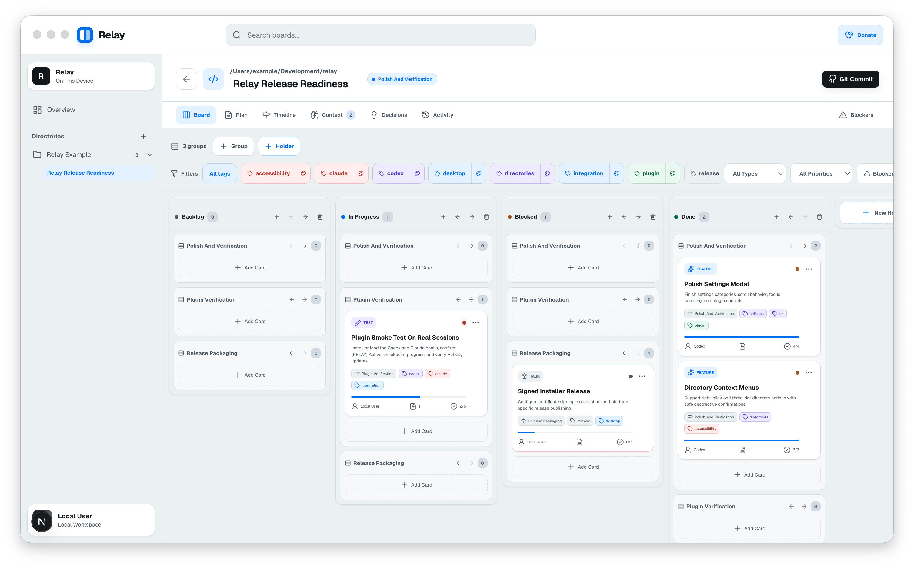

<p align="center">
  
</p>

<h1 align="center">Relay</h1>
<p align="center"><em>Persistent workboards and context for AI-assisted development.</em></p>

<p align="center">
  <a href="https://github.com/jacobpowaza/Relay/blob/main/LICENSE">
    
  </a>
  <a href="https://github.com/jacobpowaza/Relay/releases">
    
  </a>
  <a href="https://github.com/jacobpowaza/Relay/actions/workflows/ci.yml">
    
  </a>
  <a href="https://venmo.com/u/jacobpowaza">
    
  </a>
  
  
  
</p>

---

## What Is Relay?

Relay is a **local-first desktop workboard** for software development. It keeps plans, progress, decisions, and context tied to your project so you — and your AI coding agents — can pick up where you left off without starting over.

Large AI coding tasks are difficult to track. Plans and completed work get lost between sessions. Context and decisions vanish. Tokens and time are wasted re-explaining the same project. Relay solves this by giving humans, Claude Code, and Codex a persistent local workboard containing plans, cards, progress, decisions, context, and handoffs — all stored on your machine.

<p align="center">
  <strong>Download Relay, connect your coding agent, and stop restarting large tasks from scratch.</strong>
</p>

---

## Downloads

Each badge links to the latest GitHub Release where you can find the matching installer for your platform.

<p align="center">
  <a href="https://github.com/jacobpowaza/Relay/releases/latest">
    
  </a>
  <a href="https://github.com/jacobpowaza/Relay/releases/latest">
    
  </a>
  <a href="https://github.com/jacobpowaza/Relay/releases/latest">
    
  </a>
  <a href="https://github.com/jacobpowaza/Relay/releases/latest">
    
  </a>
  <a href="https://github.com/jacobpowaza/Relay/releases/latest">
    
  </a>
</p>

<p align="center">
  <a href="https://github.com/jacobpowaza/Relay/releases">
    
  </a>
</p>

| Platform | Architecture | File |
|---|---|---|
| macOS | Apple Silicon (M1–M4) | `Relay-<version>-arm64.dmg` |
| macOS | Intel | `Relay-<version>.dmg` |
| Windows | x64 | `Relay-Setup-<version>-x64.exe` |
| Windows | ARM64 | `Relay-Setup-<version>-arm64.exe` |
| Linux | x64 | `Relay-<version>.AppImage` |

<details>
<summary>macOS Gatekeeper note</summary>

The application is not yet signed with an Apple Developer ID certificate. When you open it for the first time, macOS may show "Relay cannot be opened because the developer cannot be verified." To bypass:

- Right-click (or Ctrl-click) the app and select **Open**, then click **Open** in the dialog.
- Alternatively, go to **System Settings > Privacy & Security** and click **Open Anyway**.

</details>

<details>
<summary>Windows SmartScreen note</summary>

The installer is not yet Authenticode-signed. Windows SmartScreen may show a warning. Click **More info** then **Run anyway** to install.

</details>

---

## Plugins

AI agent integrations for Claude Code and Codex are published to the [relay-plugins](https://github.com/jacobpowaza/relay-plugins) repository, which serves as a plugin marketplace for both platforms. This keeps the integrations independently installable without cloning the full Relay monorepo.

```bash
# Claude Code
claude plugin marketplace add jacobpowaza/relay-plugins
claude plugin install relay@relay-plugins

# Codex
# Follow the install guide in the relay-plugins README
```

### Install the AI Integrations

Relay integrates with AI coding agents so they can read and write board state automatically. Both integrations follow a **fail-open** design: if Relay is unavailable, the integration does not block the coding session.

### Claude Code (`[RELAY]`)

The Claude Code plugin runs via lifecycle hooks that fire on session start, post-tool-use, pre-compact, and session end.

**Install from the Relay repository:**

```bash
git clone https://github.com/jacobpowaza/Relay.git
cd Relay

# First-time setup — copy the entire plugin into Claude Code's marketplace
# directory. Claude Code auto-discovers plugins here on startup.
mkdir -p ~/.claude/plugins/marketplaces/relay-local
cp -R integrations/claude-code/. ~/.claude/plugins/marketplaces/relay-local/
```

After installing, start a new Claude Code session in a repository.

**Verify it is active:** When you open Claude Code in a repository, a startup message will show one of:

- `[RELAY] Active` — the repo is linked to a board with saved context.
- `[RELAY] Inactive` — the repo is not linked. Create a board with `/relay-progress create-board`.
- `[RELAY] Error` — the linked board was not found in Relay's storage.

**Persistent status line:** The startup message only appears once. To keep the Relay indicator visible in Claude Code's footer on every turn, register the status line:

```bash
# Deploy changes AND register the status line:
node integrations/scripts/sync-plugins.mjs --install-statusline
```

The `--install-statusline` flag registers the Relay status indicator in your global
`~/.claude/settings.json`. Without this flag, `sync-plugins.mjs` deploys plugin code
but does not modify your settings.

If you prefer to run the installer separately from within your Claude Code plugin directory:

```bash
# Run from wherever the plugin is installed
node install-statusline.mjs
```

This adds a `statusLine` entry to the GLOBAL user scope (`~/.claude/settings.json`). Project-local `.claude/settings.json` files are NOT changed — the global scope applies to all projects.

The footer shows one of:

- `[RELAY] Active · Active card title` — linked and tracking.
- `[RELAY] Inactive` — not linked.
- `[RELAY] Disabled` — integration turned off.
- `[RELAY] Error` — linked board not found.

If another status line is already configured (e.g. Caveman), the installer composes both indicators into a single wrapper script without overwriting the existing command. Run with `--force` to replace it instead.

**Enable or disable** the integration from Relay: open the user menu > Settings > Integrations.

### Codex (`@Relay`)

The Codex integration provides the same capabilities through Codex's plugin system, with an MCP server for real-time board operations.

**Install from the Relay repository:**

```bash
git clone https://github.com/jacobpowaza/Relay.git
cd Relay

# First-time setup — copy the entire plugin into Codex's plugin cache
mkdir -p ~/.codex/plugins/cache/relay-local/relay/0.1.0
cp -R integrations/codex/. ~/.codex/plugins/cache/relay-local/relay/0.1.0/
```

**Usage:** Type `/relay` in the Codex prompt:

```
/relay status              Show linked board summary
/relay resume              Load resume packet and continue work
/relay checkpoint          Write a checkpoint before switching tasks
/relay create-board "..."  Create and link a new board
```

When MCP is available, Codex uses `relay_status` and `relay_resume` tools directly. Behind the scenes, both Claude Code and Codex integrations use the same `relay-progress.mjs` script and store data in the same local workspace.

**Enable or disable** from Relay: open the user menu > Settings > Integrations.

### Keeping Integrations Updated

After pulling changes to the Relay repository, rebuild and redeploy all installed plugin copies:

```bash
node integrations/scripts/sync-plugins.mjs
```

This builds the shared integration core, vendors it into each plugin, then performs a full replacement of every installed plugin file — including plugin manifests (`.*plugin/`), MCP config, hooks, scripts, skills, and commands.

### Usage Example

1. **Start a task** — tell your agent to create a board: "Create a Relay board for adding payment UI."
2. **Check status** — the agent reads the board and sees the active card, recent context, and next step.
3. **Record progress** — the agent writes checkpoints as work completes.
4. **Resume later** — a new session loads the handoff and continues without re-reading the full project.

<details>
<summary>Advanced CLI commands</summary>

You can drive Relay directly from the Claude Code prompt without hooks:

```sh
# Show status
node ~/.claude/plugins/cache/relay-local/relay-progress/0.1.0/scripts/relay-progress.mjs status --cwd "$PWD"

# Create a board from the original user request
printf '%s' "$ORIGINAL_USER_REQUEST" |
  node ~/.claude/plugins/cache/relay-local/relay-progress/0.1.0/scripts/relay-progress.mjs \
    create-board --cwd "$PWD" --title "$PROJECT_NAME"

# Resume work from a linked board
node ~/.claude/plugins/cache/relay-local/relay-progress/0.1.0/scripts/relay-progress.mjs resume --cwd "$PWD"

# Checkpoint progress
printf '{"summary":"Implemented auth flow","changedFiles":["src/auth.ts"],"progress":75}' |
  node ~/.claude/plugins/cache/relay-local/relay-progress/0.1.0/scripts/relay-progress.mjs \
    checkpoint --cwd "$PWD" --card-id "$CARD_ID"

# Create cards, notes, context records, and decisions
node ~/.claude/plugins/cache/relay-local/relay-progress/0.1.0/scripts/relay-progress.mjs \
  create-card --cwd "$PWD" --title "Add login page" --column Ready --tags ui,security

node ~/.claude/plugins/cache/relay-local/relay-progress/0.1.0/scripts/relay-progress.mjs \
  record-decision --cwd "$PWD" --title "Use OAuth 2.0" < decision.json
```

</details>

---

## How It Works

1. **Start a large task** — You or an AI agent creates a Relay board for the project.
2. **Store the plan** — The detailed implementation plan lives in the board as Markdown.
3. **Break work into cards** — Phases, columns, and cards organize the work into trackable units.
4. **Work and update** — Cards move through columns as work progresses. Context, decisions, and evidence are recorded along the way.
5. **Resume later** — A future session loads a compact handoff (bounded to ~3k tokens) showing active card, recent changes, blockers, and next steps — no need to re-read the full project history.

Relay works without AI agents too. You can create boards, manage cards, track activity, and review decisions entirely through the desktop interface.

### Token-Saving Design

Without Relay, an agent returning to a project often re-reads past conversation logs or the full project plan — consuming tens of thousands of tokens. Relay replaces this with a bounded resume packet that surfaces only what changed and what comes next.

| Technique | Benefit |
|---|---|
| Compact handoffs (~300–1000 tokens, capped at ~3000) | Resume packet replaces re-reading full history |
| Ranked context | Only active decisions, current blockers, and relevant cards are included by default |
| No duplication | Board captures what was done, not verbatim model reasoning |
| Explicit retrieval | Agents fetch omitted details on demand instead of receiving everything upfront |
| Stable across sessions | Handoff from session N carries forward to session N+1 without repeating prior context |

---

## Screenshots

<p align="center">
  
  <br>
  <em>Board view — organize work into directories, projects, and boards</em>
</p>

<p align="center">
  
  <br>
  <em>Board detail — plan work with phases, tasks, decisions, and activity</em>
</p>

---

## Features

### Planning and Workboards

- Organize work into directories, linked projects, and boards.
- Plan with phases, detailed Markdown plans, decisions, and context records.
- Track cards with status, priority, type, tags, notes, blockers, progress, and completion criteria.
- Kanban board with drag-and-drop columns, card filters, phase grouping, and column management.
- Dashboard with board overview, recent activity, directory navigation, and a "continue working" shortcut.
- Decision log — record decisions with alternatives, consequences, and status.
- Activity timeline — every meaningful action is recorded with actor, target, and timestamp.

### AI Agent Continuity

- **Claude Code integration** — lifecycle hooks that detect repositories, link boards, and emit concise context packets (`[RELAY] Active`).
- **Codex integration** — plugin with MCP server, session hooks, and `/relay` slash commands for context resumption.
- Both integrations follow a fail-open design and are disabled by default until you enable them.

### Git Workflow

- Review staged and unstaged changes.
- Split changes into multiple focused commits.
- Pre-commit review step that re-checks HEAD before executing.
- Commit history with side-by-side comparison.
- Push from within the app.

### Local Data and Privacy

All data stays on your machine with no account required. See [Data and Privacy](#data-and-privacy) for details.

### Desktop Experience

- Auto-update — in-app update center with manual check, skip-version, dismiss, and install-and-restart.
- Single-instance lock — second launch focuses the running window.
- macOS menu-bar mode — hide to the menu bar with background presence, launch at login, and tray controls.

---

## Data and Privacy

Relay is local-first. All data is stored on your machine in the operating system's application data directory. No account, registration, or internet connection is required to use the desktop app.

- No telemetry, analytics, or usage data is collected.
- No data is sent to any external server unless you configure an optional API endpoint.
- Claude Code and Codex integrations are disabled by default until you enable them.
- The application never creates sample boards or fake activity — new installations start empty.

<details>
<summary>Storage paths</summary>

| Data | Path |
|---|---|
| Workspace (boards, cards, plans) | `userData/relay-data/workspace.json` |
| App settings (updates, background) | `userData/relay-settings.json` |
| Integration plugin config | `~/.relay/integrations/config.json` |

`userData` resolves to the standard OS application data directory:

| Platform | Path |
|---|---|
| macOS | `~/Library/Application Support/Relay/` |
| Windows | `%APPDATA%/Relay/` |
| Linux | `~/.config/Relay/` |

</details>

---

## Developer Documentation

### Prerequisites

- **Node.js** 22 or newer
- **pnpm** 11 (install: `npm install -g pnpm@11`)
- macOS, Windows, or Linux

### Development Setup

```bash
git clone https://github.com/jacobpowaza/Relay.git
cd Relay
pnpm install
```

Start the desktop app in development mode:

```bash
pnpm app:dev
```

This starts the Next.js renderer dev server and launches the Electron app connected to it. The renderer automatically uses an available port (default: 4317, fallback: 4318+ if taken). The API server follows the same pattern, defaulting to 4318 and scanning forward.

Load optional example data:

```bash
mkdir -p "$HOME/Library/Application Support/Relay/relay-data"
cp docs/examples/mock-workspace.json "$HOME/Library/Application Support/Relay/relay-data/workspace.json"
pnpm app:dev
```

### Environment Configuration

The environment file is optional for local desktop development. Copy `.env.example` to `.env` for a starting point.

<details>
<summary>Environment variables</summary>

| Variable | Required | Default | Purpose |
|---|---|---|---|
| `APP_ORIGIN` | No | `http://localhost:4317` | Origin of the renderer frontend |
| `API_ORIGIN` | No | `http://localhost:4318` | API server listen address |
| `DATABASE_URL` | No | — | PostgreSQL connection string (optional sync) |
| `BETTER_AUTH_SECRET` | No | — | Auth signing secret (optional sync) |
| `BETTER_AUTH_URL` | No | — | Auth URL (optional sync) |
| `NEXT_PUBLIC_API_ORIGIN` | No | — | API origin exposed to browser (optional sync) |
| `OBJECT_STORAGE_ENDPOINT` | No | `http://localhost:9000` | S3-compatible storage endpoint (optional sync) |
| `OBJECT_STORAGE_ACCESS_KEY` | No | — | Storage access key |
| `OBJECT_STORAGE_SECRET_KEY` | No | — | Storage secret key |
| `OBJECT_STORAGE_BUCKET` | No | — | Storage bucket name |

</details>

### Infrastructure (Optional)

For development with the optional API, database, and object storage:

```bash
# Start PostgreSQL and MinIO
docker compose -f infra/compose.yaml up -d

# Run database migrations
pnpm --filter @relay/database db:migrate

# Start the API
pnpm api:dev
```

### Available Scripts

| Script | Description |
|---|---|
| `pnpm dev` | Run the desktop app in development mode |
| `pnpm app:dev` | Same as above (alias) |
| `pnpm api:dev` | Run the optional API server in development mode |
| `pnpm build` | Build all packages and the web renderer |
| `pnpm app:package` | Package the desktop app for distribution |
| `pnpm lint` | Run ESLint across all packages |
| `pnpm typecheck` | Run TypeScript type checking across all packages |
| `pnpm test` | Run tests across all packages |
| `pnpm test:watch` | Run tests in watch mode |
| `pnpm check` | Run lint + typecheck + test + build (CI gate) |

### Build and Packaging

```bash
# Build all packages and the web renderer
pnpm build

# Package the desktop app (DMG/EXE/AppImage)
pnpm app:package
```

Packaging uses [electron-builder](https://www.electron.build/) configured in `apps/desktop/electron-builder.yml`. Artifacts are written to `apps/desktop/release/`.

When running from a packaged build, the application does not require `.env` configuration. On first launch it creates the workspace data directory, initializes an empty workspace, generates default settings, and uses safe defaults for all configuration values.

<details>
<summary>Project architecture</summary>

```text
relay/
├── apps/
│   ├── desktop/          Electron main process, preload bridge, local storage
│   ├── web/              Static Next.js renderer embedded in Electron
│   └── api/              Optional API server (Fastify) for agent/sync
├── packages/
│   ├── application/      Application service layer
│   ├── contracts/        Shared Zod schemas and API contracts
│   ├── database/         Optional PostgreSQL persistence (Drizzle ORM)
│   └── domain/           Domain rules, ranking, context, evidence
├── integrations/
│   ├── claude-code/      Claude Code plugin, hooks, and scripts
│   ├── codex/            Codex plugin, MCP server, hooks, and scripts
│   └── core/             Shared integration utilities
├── docs/
│   ├── decisions/        Architecture decision records
│   ├── examples/         Example workspace data
│   ├── screenshots/      README screenshots
│   └── stages/           Implementation stage reports
└── infra/
    └── compose.yaml      Local dev infrastructure (PostgreSQL, MinIO)
```

**Desktop App (Electron)** — Owns all local file access. The renderer communicates through a context-isolated preload bridge.

**Web Renderer (Next.js)** — Static App Router export (`output: "export"`) running in the Electron renderer process. Uses React, CSS modules, and Lucide icons.

**Core Domain** — `packages/domain/` contains pure business logic: entity types, state machines, ranking algorithms, and evidence rules.

**Integrations** — Fail-open design: each plugin identifies the Git repository, checks for a linked board, emits a concise context packet, records checkpoints, and produces a handoff on session end.

</details>

### Release Process

Releases are built and published through GitHub Actions. To trigger a release:

1. Update the version in `package.json` (root and `apps/desktop/package.json`).
2. Tag the commit: `git tag v<version>` (e.g., `v0.2.0`).
3. Push the tag: `git push origin v<version>`.
4. The release workflow builds and publishes artifacts automatically.

**Manual package:**

```bash
pnpm build
pnpm app:package
```

Artifacts are written to `apps/desktop/release/`.

<details>
<summary>Code signing</summary>

**macOS:** For signed and notarized builds, set these environment variables before packaging:

```
CSC_LINK=/path/to/DeveloperIDApplication.p12
CSC_KEY_PASSWORD=********
APPLE_ID=you@apple.com
APPLE_APP_SPECIFIC_PASSWORD=****-****-****-****
APPLE_TEAM_ID=XXXXXXXXXX
```

**Windows:** For Authenticode-signed installers:

```
CSC_LINK=/path/to/codesign.pfx
CSC_KEY_PASSWORD=********
```

</details>

### Contributing

1. Fork the repository.
2. Create a feature branch: `git checkout -b feature/my-feature`.
3. Make your changes.
4. Run `pnpm check` to verify lint, types, tests, and build.
5. Commit your changes.
6. Push and open a Pull Request.

All contributions must be licensed under AGPL-3.0.

### Troubleshooting

| Problem | Solution |
|---|---|
| macOS "cannot be opened because the developer cannot be verified" | Right-click the app and select Open, or go to System Settings > Privacy & Security and click Open Anyway |
| Windows SmartScreen blocks installation | Click "More info" then "Run anyway" |
| App won't start (port conflict) | Kill the conflicting process or set `API_PORT` / `RELAY_DEV_SERVER_URL` to use different ports |
| Workspace data is missing | Check the storage path for your OS (see Data and Privacy section) |
| Integration plugins not working | Ensure the integration is enabled in Relay: open the user menu > Settings > Integrations |
| Renderer shows blank screen | Open Developer Tools (Cmd+Option+I in dev mode) and check for errors |
| Git workbench shows no changes | Ensure the board is linked to a local Git repository directory |
| Auto-update says "Updates are delivered in packaged builds" | Expected in development mode. Packaged builds can check for updates |

<details>
<summary>Limitations</summary>

- **No server-side sync yet** — boards are stored locally only.
- **No authentication in desktop mode** — authentication is only present in the optional API component.
- **No hosted SaaS** — there is no cloud-hosted version.
- **Single-user per instance** — the desktop app is designed for one user.
- **No mobile app** — Relay runs on desktop only (macOS, Windows, Linux).
- **Unsigned installers** — macOS and Windows builds are unsigned by default.
- **Auto-update requires signed builds** — unsigned builds cannot auto-update.
- **Markdown-only plans** — no rich-text or WYSIWYG editor.
- **10 MB workspace limit** — workspace files are capped at 10 MB.

</details>

<details>
<summary>Roadmap</summary>

- Server-side sync for boards shared across devices and team members
- Signed installers (macOS notarization, Windows Authenticode)
- Production auto-update channel
- User accounts with workspace membership
- Stable API for third-party integrations
- Improved context ranking for agent packets
- Template boards for common project types
- GitHub integration (import issues, create PRs from cards, link commits)
- Full-text search across boards, cards, and context
- Performance improvements for large boards
- Dark mode refinements
- Plugin marketplace for community integrations

</details>

### Acknowledgements

- [electron-builder](https://www.electron.build/) — cross-platform packaging
- [electron-updater](https://github.com/electron-userland/electron-builder/tree/master/packages/electron-updater) — auto-update support
- [Next.js](https://nextjs.org/) — static site renderer
- [Fastify](https://fastify.dev/) — API server framework
- [Drizzle ORM](https://orm.drizzle.team/) — optional database ORM
- [Turbo](https://turbo.build/) — monorepo build system
- [Zod](https://zod.dev/) — schema validation
- [Lucide](https://lucide.dev/) — open-source icons
- [Geist](https://vercel.com/font) — UI font family

### License

[AGPL-3.0](LICENSE) — Relay is free software. See `LICENSE` for details.

If you find Relay useful, consider [donating via Venmo](https://venmo.com/u/jacobpowaza) to help fund future development.
